# Manual de Usuario

> **Sistema de Inventario Pro** — Guía de uso por módulo para el usuario final.

---

## Tabla de contenidos

1. [Acceso al sistema](#1-acceso-al-sistema)
2. [Dashboard](#2-dashboard)
3. [Productos](#3-productos)
4. [Clientes](#4-clientes)
5. [Ventas](#5-ventas)
6. [Compras](#6-compras)
7. [Traslados](#7-traslados)
8. [Devoluciones](#8-devoluciones)
9. [Reacondicionamiento](#9-reacondicionamiento)
10. [CRM](#10-crm)
11. [Kardex](#11-kardex)
12. [Conversiones de unidad](#12-conversiones-de-unidad)
13. [Auditoría](#13-auditoría)
14. [Configuración](#14-configuración)
15. [Usuarios, roles y permisos](#15-usuarios-roles-y-permisos)
16. [Perfil y 2FA](#16-perfil-y-2fa)
17. [Cierre de sesión](#17-cierre-de-sesión)

---

## 1. Acceso al sistema

### 1.1 Inicio de sesión

Abrí el sistema en tu navegador:

- **URL del sistema**: <https://sitecsas.site/>


**Pasos:**

1. Ingresá tu **correo electrónico** registrado.
2. Ingresá tu **contraseña**.
3. Hacé clic en **Iniciar sesión**.

> Si tu cuenta tiene **doble factor (2FA)** activado, el sistema te pedirá un código de 6 dígitos generado por tu app autenticadora (Google Authenticator, Authy, 1Password). Si perdiste el dispositivo, podés usar uno de tus **códigos de recuperación**.

Cuando un usuario tiene 2FA activo, el flujo de login tiene **dos pasos**:

1. Email + contraseña → si son válidos y hay 2FA, redirige a `/login-2fa`
2. En esa pantalla ingresás el código TOTP de 6 dígitos. También hay un link **"Usar código de recuperación"** para casos de emergencia.

> La pantalla `/login-2fa` solo es accesible durante el flujo de autenticación; no se puede acceder directamente. Por eso no se incluye captura: aparece automáticamente entre el primer paso y el dashboard cuando el usuario tiene 2FA habilitado.

### 1.2 Acceso denegado

Si intentás acceder a un módulo sin el permiso correspondiente, verás:

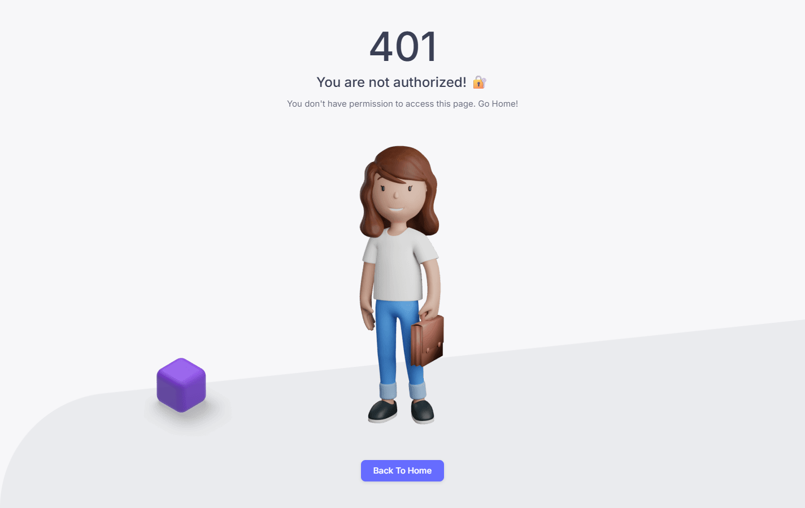

Tu rol no tiene el permiso requerido. Contactá al administrador para que revise tu rol y los permisos asignados.

### 1.3 Errores comunes

| Mensaje | Causa | Solución |
|---|---|---|
| "Credenciales inválidas" | Email o contraseña incorrectos | Verificar y reintentar |
| "Demasiados intentos" | Más de 5 intentos fallidos en 1 minuto | Esperar 1 minuto |
| "Cuenta inactiva" | Tu usuario fue desactivado | Contactar al administrador |
| Pantalla en blanco / 401 al navegar | Sesión expirada | Cerrar sesión y volver a entrar |
| "No autorizado" tras hacer click en menú | Tu rol no tiene el permiso del módulo | Solicitar al administrador que lo agregue |

---

## 2. Dashboard

Al iniciar sesión, el sistema muestra el **Dashboard** con los indicadores principales del negocio.

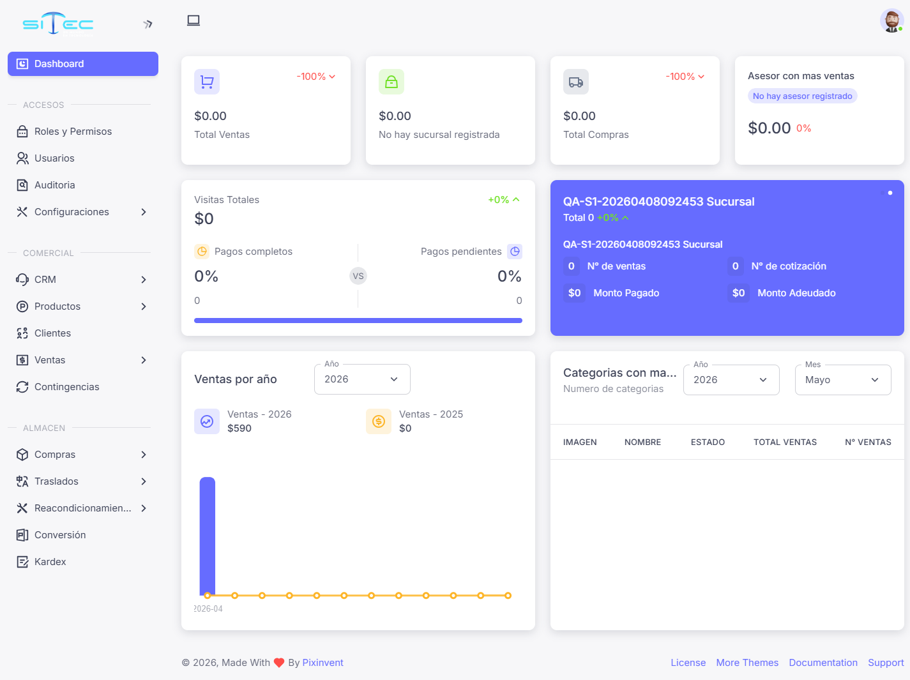

**Qué encontrás aquí:**

- KPIs generales (ventas, compras, clientes, productos)
- Gráficos de ventas por mes/año
- Top de asesores por ventas
- Categorías más vendidas
- Reporte de ventas por sucursal

> Los datos se filtran por sucursal y rango de fechas. Si no ves información, verificá que tengas permisos sobre alguna sucursal y datos en el período.

---

## 3. Productos

### 3.1 Listado de productos

**Ruta**: menú lateral → **Productos** → **Listado**

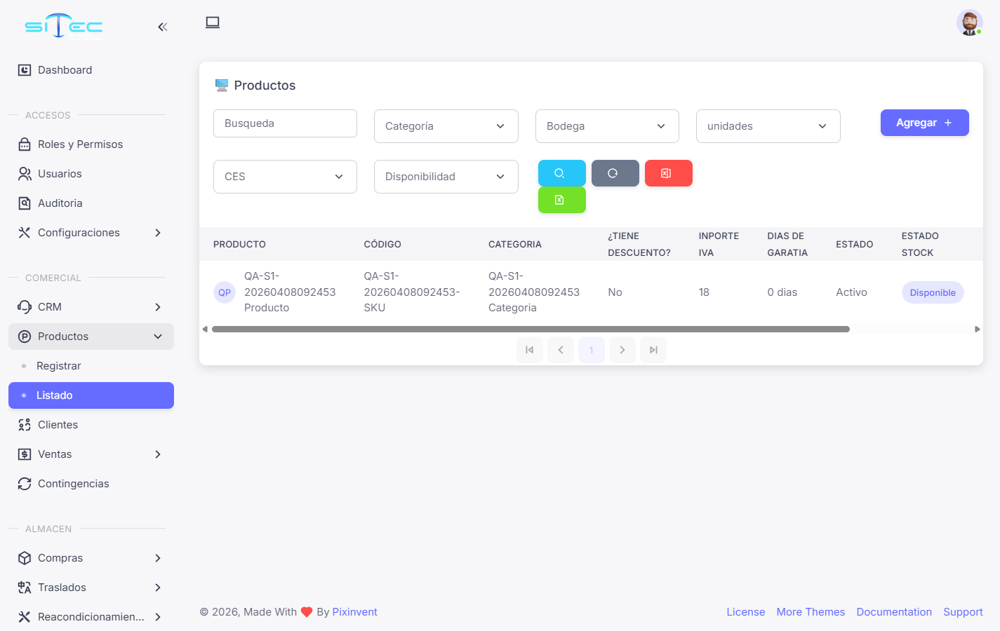

**Acciones disponibles:**

- **Filtrar** por categoría, almacén, unidad, sucursal, disponibilidad
- **Buscar** por SKU, nombre o serial
- **Ver detalle** clickeando una fila
- **Editar** (ícono de lápiz) — requiere permiso `edit_product`
- **Eliminar** (ícono de papelera) — requiere permiso `delete_product`
- **Exportar a Excel** — descarga un archivo `.xlsx` con el listado
- **Importar Excel** — subí un `.xlsx` con la plantilla del sistema

### 3.2 Crear / editar producto

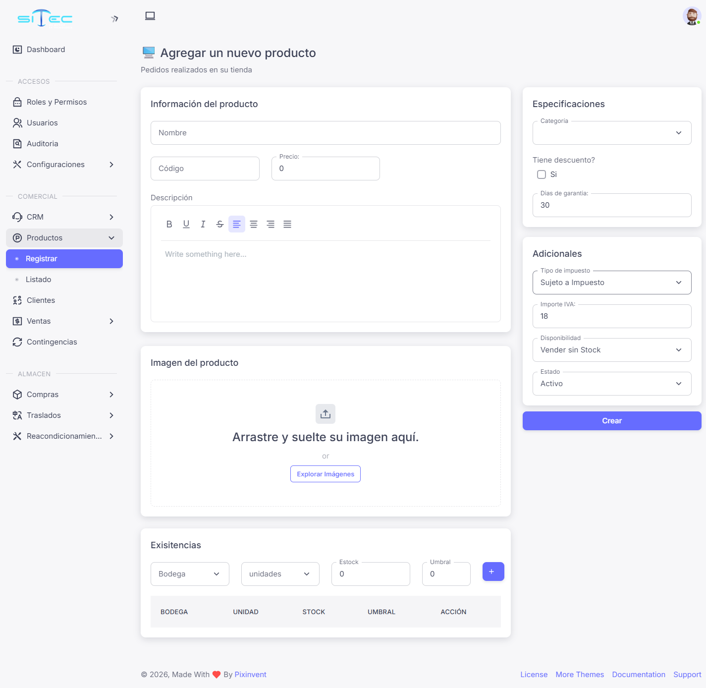

Para **editar** un producto existente, hacé clic en el ícono de lápiz desde el listado:

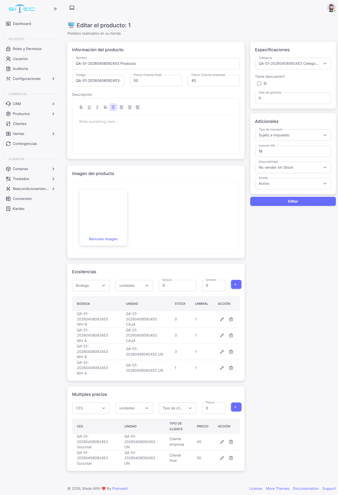

**Campos obligatorios:**

- **Nombre** (`title`)
- **Categoría** — debe estar creada previamente en Configuración
- **Precio general** y **Precio empresa**
- **IVA aplicable** (%)

**Campos opcionales pero recomendados:**

- **SKU** — código único de inventario
- **Marca, Modelo, Número de parte, Código interno**
- **Días de garantía**
- **Descripción** y **Imagen**

**Para productos técnicos / refurbished:**

- **Tipo de equipo** (`equipment_type`)
- **Estado de condición** (nuevo, usado, refurbished)
- **Costo base** — precio de adquisición
- **Comentarios técnicos**

> Al guardar, el producto queda en estado "Activo" y disponible para venta. El stock se asigna por almacén desde el módulo de stock.

### 3.3 Gestión de stock por almacén

Una vez creado el producto, asigná stock por almacén desde el botón **Inventario** del listado, o creá entradas vía **Compras** o **Stock inicial** (recomendado para datos históricos).

---

## 4. Clientes

**Ruta**: menú lateral → **Clientes**

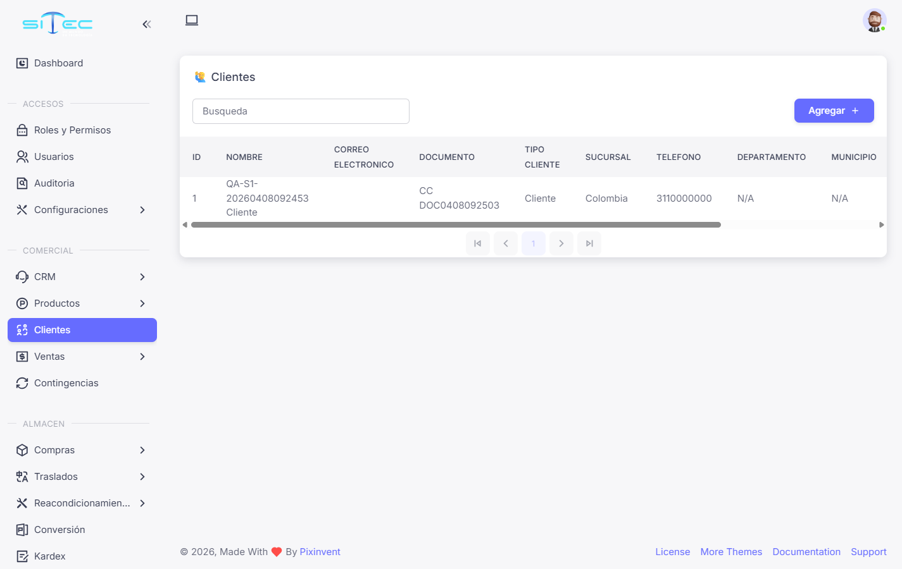

### 4.1 Tipos de cliente

| Tipo | Cuándo usar |
|---|---|
| Cliente final (1) | Personas naturales — usa precio general |
| Cliente empresa (2) | Empresas — usa precio empresa con descuentos diferenciados |

### 4.2 Crear cliente

Hacé clic en **Agregar**. Se abre un diálogo modal con el formulario:

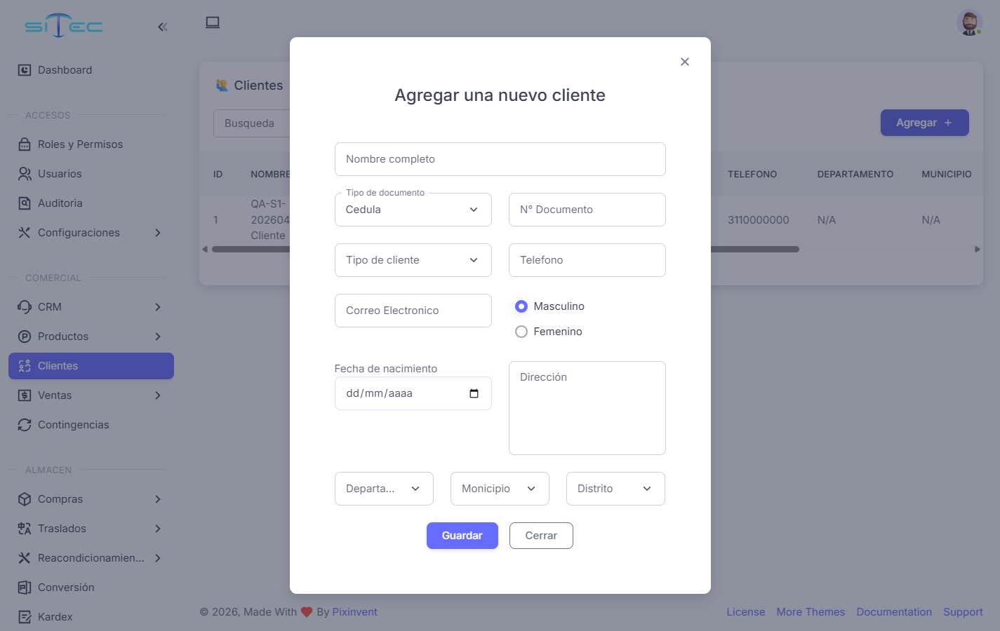

Completá:

- **Tipo de cliente**, **Tipo de documento** (CC, NIT, Pasaporte) y **Número**
- **Nombre** y **Apellido**
- **Email** y **Teléfono**
- **Departamento, Municipio, Distrito, Dirección**
- **Sucursal asignada**
- **Fecha de nacimiento, Género** (opcionales)

> El sistema valida que el número de documento no esté repetido para el mismo tipo.

### 4.3 Editar y eliminar

Desde el listado, ícono de lápiz para editar y papelera para eliminar (soft delete — los datos quedan auditables).

---

## 5. Ventas

### 5.1 Listado de ventas

**Ruta**: menú lateral → **Ventas** → **Listado**

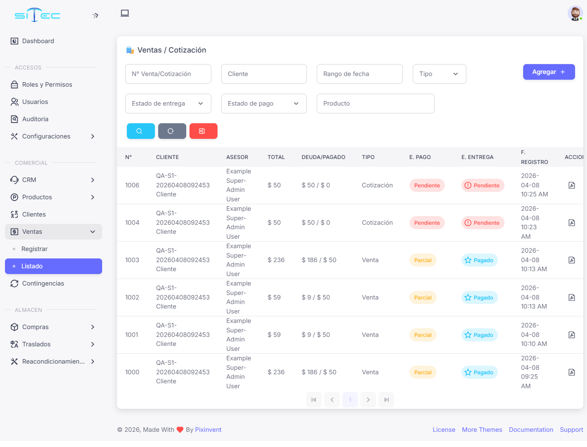

**Filtros disponibles:**

- Por **cliente** (búsqueda inteligente)
- Por **rango de fechas**
- Por **estado de venta** (Venta / Cotización)
- Por **estado de pago** (Pendiente / Parcial / Total)
- Por **sucursal**

**Acciones por fila:**

- **Ver detalle** — abre la ficha completa con líneas, pagos e historial
- **Editar** — solo cotizaciones o ventas pendientes
- **Generar PDF** — descarga el comprobante imprimible
- **Anular** — restituye stock y deja registro auditable

### 5.2 Crear nueva venta o cotización

**Ruta**: menú lateral → **Ventas** → **Nueva Venta** (o botón **Agregar** del listado)

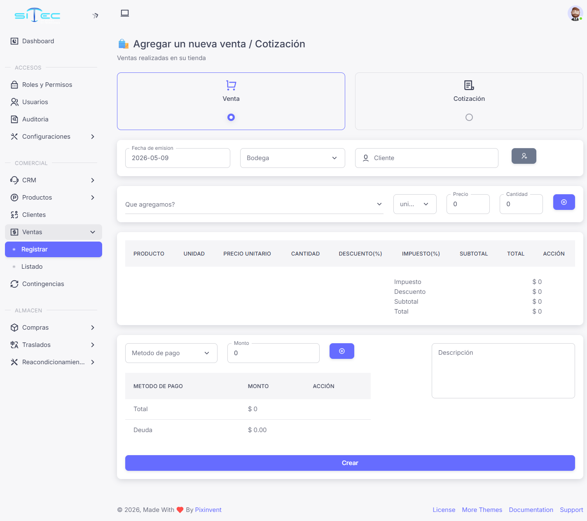

**Pasos:**

1. **Seleccionar tipo de operación**: Venta o Cotización.
2. **Seleccionar cliente**: usar el buscador inteligente. Si no existe, podés crearlo desde el ícono **+**.
3. **Agregar productos**:
   - Buscar el producto por nombre o SKU
   - Elegir **almacén de salida** (debe tener stock)
   - Definir **cantidad** y **unidad**
   - Aplicar **descuento por línea** si corresponde (no puede superar el descuento máximo del producto)
4. **Verificar totales**: subtotal, IVA y total se calculan automáticamente.
5. **Registrar pagos** (solo Venta, no Cotización):
   - Método: efectivo, transferencia, tarjeta, etc.
   - Monto: se puede registrar pago parcial. El saldo queda como deuda.
6. **Guardar**.

> **Importante**: si seleccionás **Venta**, al guardar el sistema **descuenta el stock** de los almacenes elegidos. Si es **Cotización**, NO se descuenta stock — sirve solo como propuesta comercial.

### 5.3 Detalle / editar venta

Desde el listado, ícono de lápiz para abrir la vista de edición con líneas, pagos e historial:

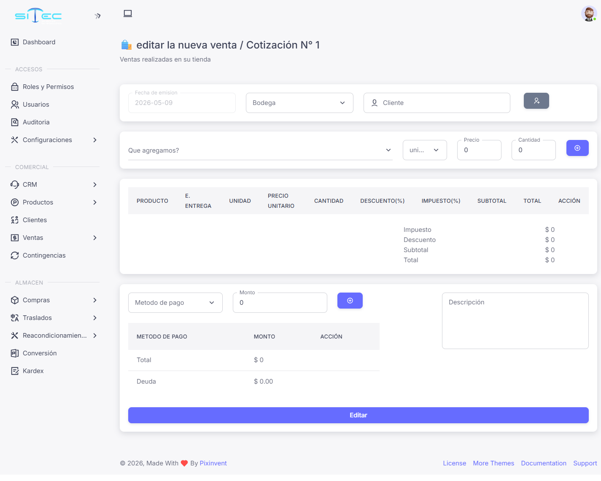

### 5.4 Convertir cotización a venta

Desde el detalle de una cotización, hacer clic en **Convertir a venta**. El sistema valida stock y aplica el descuento.

### 5.5 Anular venta

Desde el detalle, botón **Anular**. El sistema:

1. Restituye stock a los almacenes originales
2. Marca la venta con `state=Anulada`
3. Registra el evento en auditoría

> No se puede anular una venta que tenga devoluciones procesadas. Procesar primero las devoluciones.

---

## 6. Compras

### 6.1 Listado de compras

**Ruta**: menú lateral → **Compras** → **Listado**

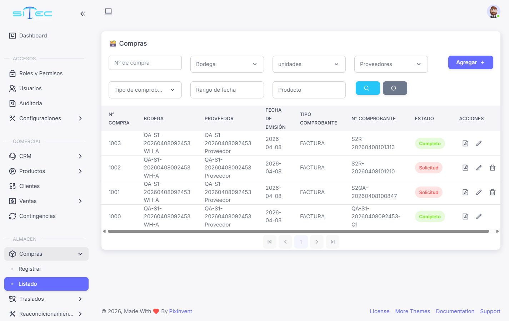

**Estados de compra:**

| Estado | Significado |
|---|---|
| 1 — Solicitud | Orden creada, sin recepción |
| 2 — Parcial | Algunos detalles recibidos |
| 3 — Entregado | Todos los detalles recibidos, stock actualizado |

### 6.2 Crear compra

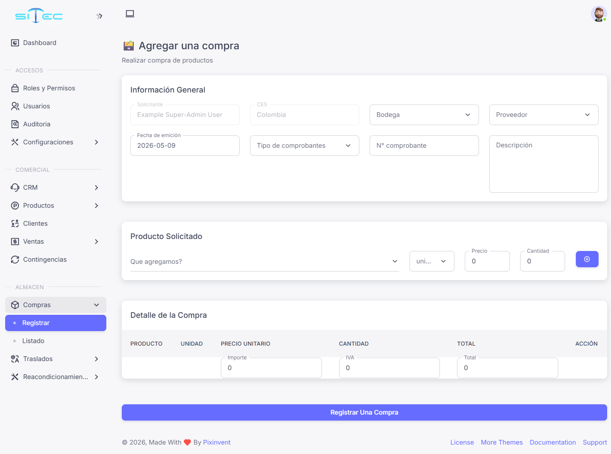

Pasos:

1. Seleccionar **proveedor** (debe estar registrado en Configuración → Proveedores).
2. Elegir **almacén de destino** y **sucursal**.
3. Indicar **fecha de emisión** y **fecha esperada de entrega**.
4. Agregar **tipo y número de comprobante**.
5. Cargar **detalles**: producto, unidad, cantidad, precio unitario.
6. Verificar totales (subtotal, IVA, total).
7. Guardar.

### 6.3 Atender (recibir) un detalle

En el detalle de la compra, cada línea tiene un botón **Atender**. Al hacer clic:

- Se marca la línea como recibida
- Se incrementa el stock en el almacén destino
- Se registra fecha de recepción
- Si **todas** las líneas están atendidas, la compra cambia a estado **Entregado**

> No se puede re-atender un detalle ya recibido (el sistema devuelve error 403). Si hubo un error, anular y rehacer la compra.

### 6.4 Generar PDF

Botón **PDF** en el detalle. Descarga un comprobante imprimible.

---

## 7. Traslados

Movimientos de stock entre almacenes (típicamente entre sucursales o de bodega central a sucursal).

**Ruta**: menú lateral → **Traslados** → **Listado**

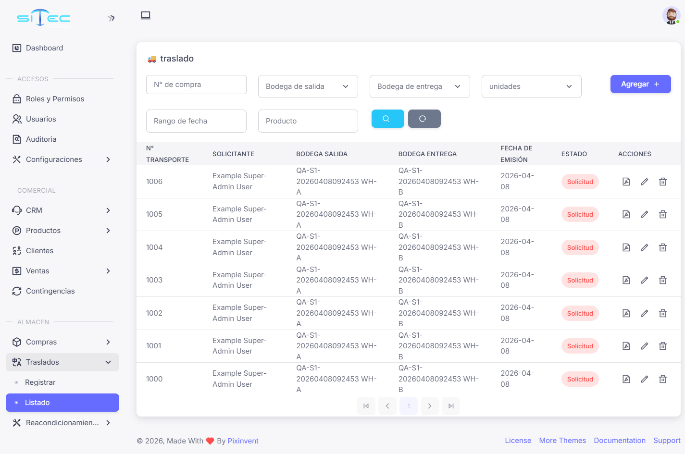

### 7.1 Estados de traslado

| Estado | Significado |
|---|---|
| 1 — Solicitud | Solicitud creada |
| 2 — Revisión salida | En verificación previa al despacho |
| 3 — Salida | Despachado, stock descontado del origen |
| 4 — Llegada | Recibido en destino, en verificación |
| 5 — Revisión llegada | En conteo y validación |
| 6 — Entrega | Cerrado, stock incrementado en destino |

### 7.2 Crear traslado

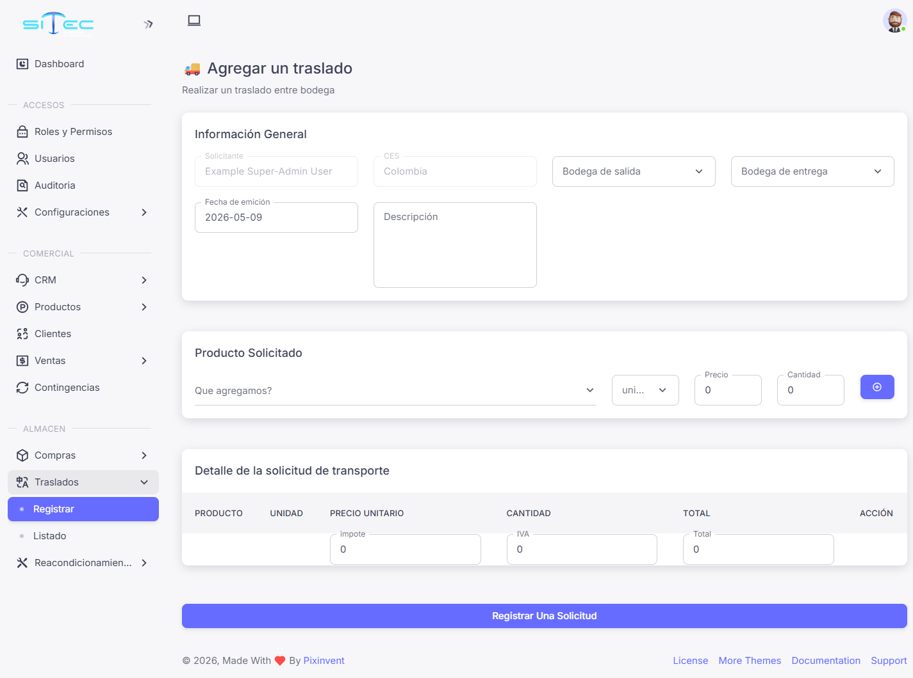

1. Seleccionar **almacén de origen** y **almacén de destino**.
2. Indicar **fecha de emisión** y **fecha esperada de entrega**.
3. Cargar detalles: producto, unidad, cantidad.
4. Guardar (estado inicial: **Solicitud**).

### 7.3 Marcar salida (descuenta stock origen)

Desde el detalle del traslado, botón **Marcar salida** por línea o **Marcar todas las salidas**. El sistema descuenta el stock del almacén origen.

### 7.4 Marcar entrega (suma stock destino)

Una vez recibido el material, botón **Marcar entrega** por línea. El sistema incrementa el stock del almacén destino.

> No se puede marcar entrega de un detalle sin haber registrado la salida. El sistema bloquea con error 403.

---

## 8. Devoluciones

Gestión de devoluciones, reparaciones y reemplazos vinculados a una venta previa.

**Ruta**: menú lateral → **Devoluciones**

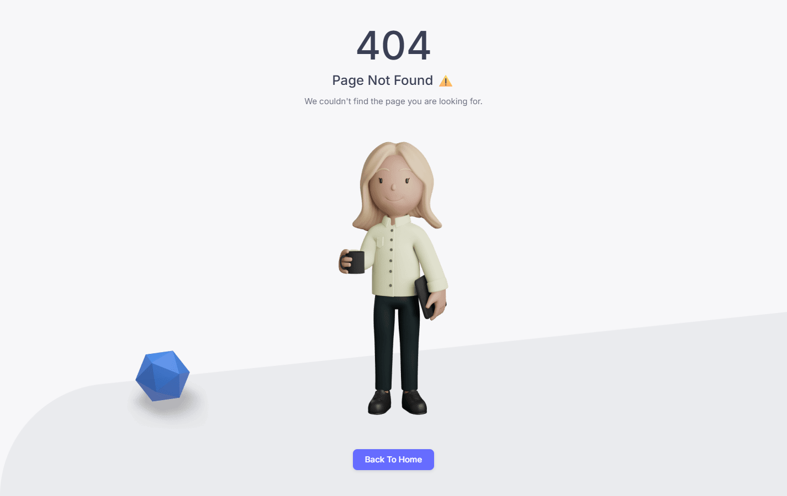

### 8.1 Tipos de operación

| Tipo | Significado |
|---|---|
| 1 — Reparación | Producto vuelve para reparar y luego se devuelve al cliente |
| 2 — Reemplazo | Cambio por otra unidad |
| 3 — Devolución | Devolución total con reembolso |

### 8.2 Estados

| Estado | Significado |
|---|---|
| 1 — Pendiente | Recién registrado |
| 2 — Revisión | Equipo en evaluación |
| 3 — Reparado | Reparación completada |
| 4 — Descartado | No procedente o irreparable |

### 8.3 Crear devolución

1. **Buscar venta** por número o cliente
2. Seleccionar la **línea de venta** (`sale_detail`) afectada
3. Indicar **tipo** (reparación / reemplazo / devolución)
4. Cargar **cantidad** y **almacén receptor** (donde se recibe físicamente el producto)
5. Agregar **descripción** del problema reportado
6. Guardar

### 8.4 Resolución

Desde el detalle, cambiar el **estado** y agregar **fecha de resolución** + **descripción**. El sistema queda con trazabilidad completa.

---

## 9. Reacondicionamiento

Módulo técnico para gestionar el ensamblaje, reparación y valoración de equipos refurbished.

**Ruta**: menú lateral → **Reacondicionamiento** → **Listado**

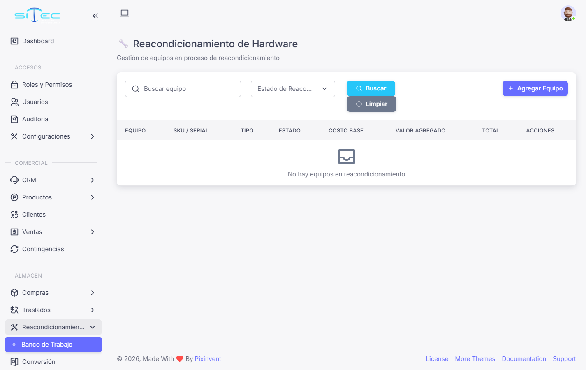

### 9.1 Workbench

Vista completa del workbench (acceso desde el listado, click en el ícono de la mesa de trabajo):

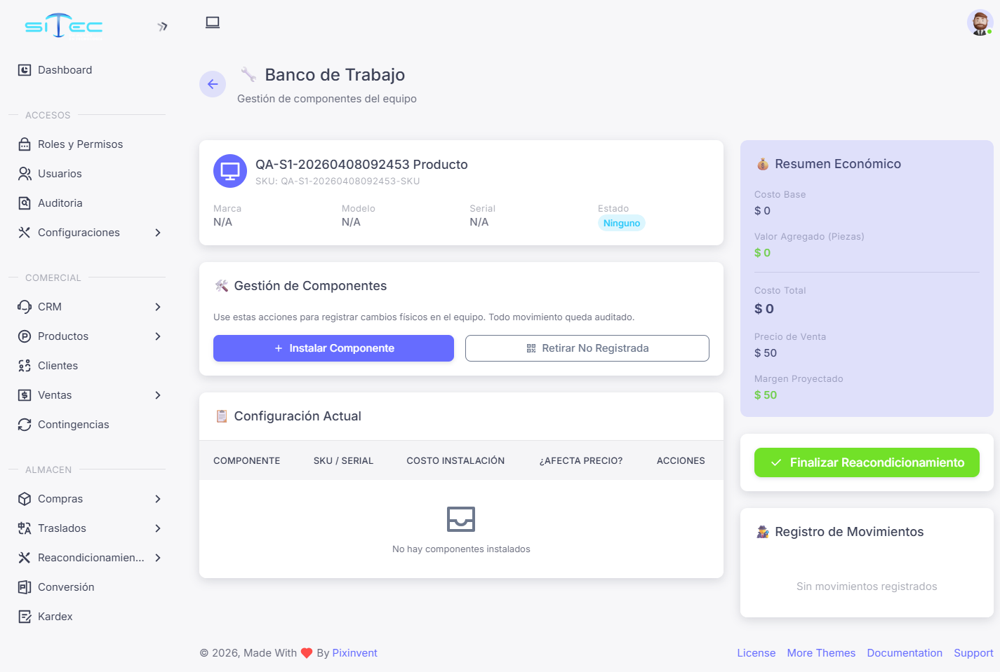

Cada equipo tiene un workbench dedicado donde el técnico puede:

- **Ver el equipo base** y sus componentes actuales
- **Agregar componentes** desde el inventario (descuenta stock del almacén origen y suma su costo al `refurbished_value` del equipo)
- **Retirar componentes** instalados (devuelve a inventario y resta del costo)
- **Retirar componentes sin registro** (componente físico que no estaba registrado — no afecta inventario)
- **Finalizar** — marca el equipo como listo para venta con su nuevo `refurbished_value`

### 9.2 Flujo recomendado

```
1. Equipo entra al taller (inventario base)
   └→ 2. Iniciar reacondicionamiento desde el listado
      └→ 3. En el workbench, instalar componentes nuevos:
            - cada componente descuenta del inventario
            - se suma su costo al refurbished_value
      └→ 4. Si hay errores, retirar componentes
      └→ 5. Una vez completado, FINALIZAR
            - el equipo queda disponible para venta
            - su precio sugerido = refurbished_value
```

> Todas las operaciones quedan registradas en `refurbish_histories` con técnico, timestamp y costo delta.

---

## 10. CRM

### 10.1 Leads (prospectos)

**Ruta**: menú lateral → **CRM** → **Leads**

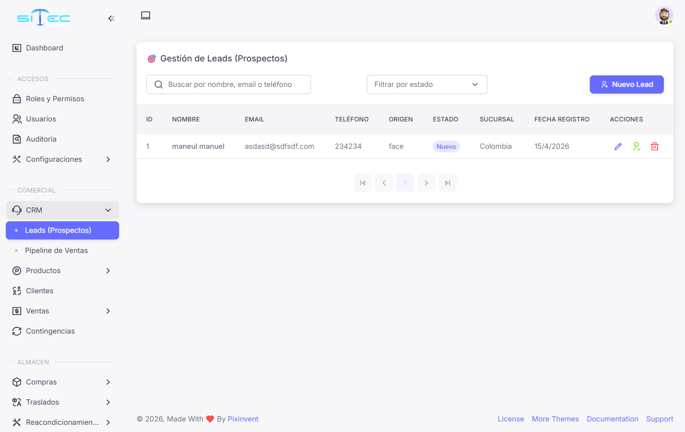

Los **leads** son prospectos previos al cliente. Cada lead tiene:

- Datos de contacto (nombre, email, teléfono, empresa)
- **Origen** (`source`): web, referido, llamada, evento
- **Estado** (`status`): nuevo, contactado, calificado, descartado
- **Probabilidad de conversión** (%)

**Acciones:**

- **Crear lead** (manual o por importación)
- **Editar** los datos
- **Convertir a cliente** — crea automáticamente el registro en Clientes y opcionalmente una Oportunidad asociada

### 10.2 Pipeline de oportunidades

**Ruta**: menú lateral → **CRM** → **Pipeline**

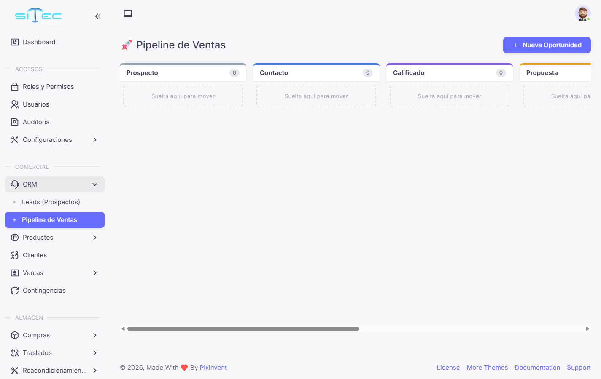

Vista **Kanban** con las oportunidades agrupadas por etapa del pipeline. Las etapas son configurables (ej. *Cualificación → Propuesta → Negociación → Cierre*).

**Acciones:**

- **Arrastrar y soltar** una oportunidad entre etapas
- **Ver detalle** de cada oportunidad (valor, fecha esperada, lead origen)
- **Registrar actividades** (llamadas, emails, reuniones, tareas)

### 10.3 Actividades

Tareas de seguimiento ligadas a una oportunidad. Tipos: llamada, email, reunión, tarea genérica. Permite agendar fecha y registrar resultado.

---

## 11. Kardex

Historial detallado de movimientos de un producto en un almacén.

**Ruta**: menú lateral → **Kardex**

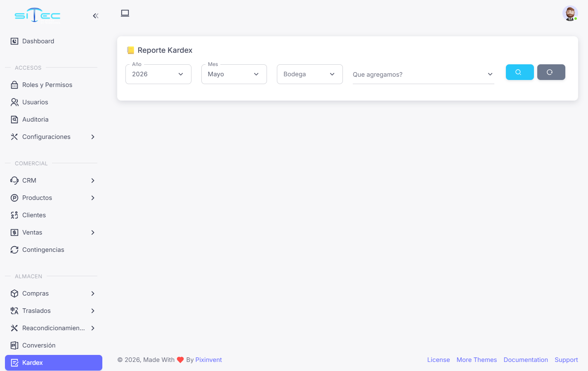

### 11.1 Cómo consultar

1. Seleccionar **producto**
2. Seleccionar **almacén**
3. Definir **rango de fechas**
4. Hacer clic en **Consultar**

El sistema devuelve la cronología completa: entradas (compras, traslados recibidos, conversiones), salidas (ventas, traslados despachados, conversiones), con saldo acumulado por movimiento.

> Útil para auditorías de inventario, conciliaciones y trazabilidad ante reclamos.

---

## 12. Conversiones de unidad

Permite convertir stock entre dos unidades (ej. una caja de 12 unidades → 12 unidades sueltas).

**Ruta**: menú lateral → **Conversiones**


### 12.1 Crear conversión

1. Seleccionar **producto** y **almacén**
2. Indicar **unidad origen** y **cantidad**
3. Indicar **unidad destino**
4. El sistema calcula automáticamente la cantidad equivalente usando el factor configurado en `unit_conversions`
5. Guardar

> El sistema valida stock disponible. Si no hay suficiente, devuelve error 403.

### 12.2 Revertir conversión

Eliminar la conversión devuelve el stock al estado previo. Útil si se hizo por error.

---

## 13. Auditoría

Registro completo de eventos del sistema para trazabilidad y compliance.

**Ruta**: menú lateral → **Auditoría** → **Logs**

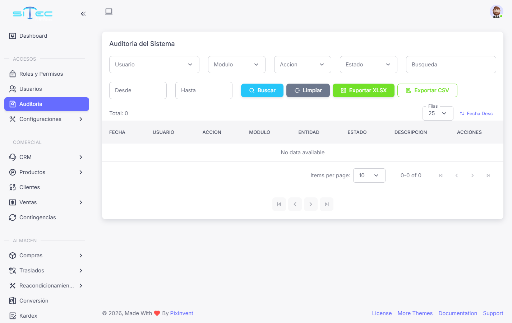

### 13.1 Qué se registra

- Acceso a rutas protegidas (quién, cuándo, IP, User-Agent)
- Cambios sobre productos, ventas, compras, traslados, refurbish, usuarios — con **diff de campos** (valor anterior y nuevo)
- Navegación dentro del sistema

### 13.2 Filtros

- Por **usuario** (actor)
- Por **acción** (created, updated, deleted, viewed, exported)
- Por **entidad** (Product, Sale, etc.)
- Por **rango de fechas**

### 13.3 Exportación

Botón **Exportar** → elegir formato:

- **XLSX** (Excel) — recomendado para análisis
- **CSV** — recomendado para integración con otros sistemas

> La exportación queda registrada en `audit_exports`. Solo los usuarios con permiso `export_audit_logs` pueden exportar.

---

## 14. Configuración

> Solo usuarios con permiso `settings` pueden acceder.

### 14.1 Sucursales

**Ruta**: menú lateral → **Configuración** → **Sucursales**

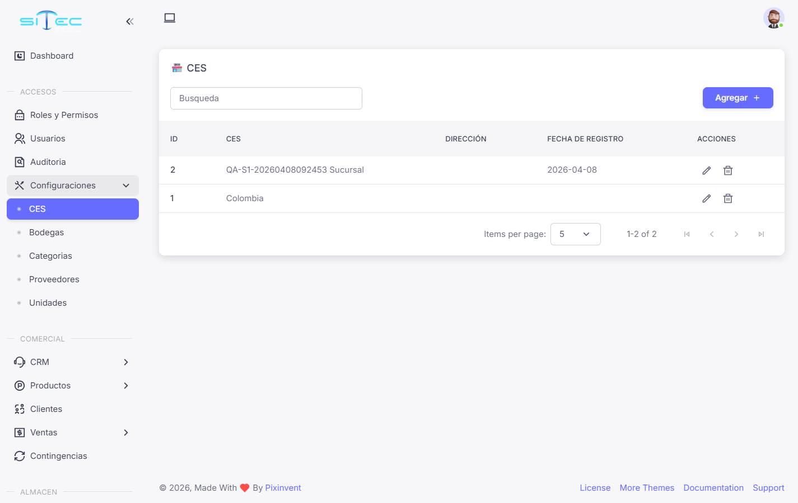

Una sucursal es una sede física de la empresa. Cada sucursal puede tener múltiples almacenes y precios diferenciados.

### 14.2 Almacenes

**Ruta**: menú lateral → **Configuración** → **Almacenes**

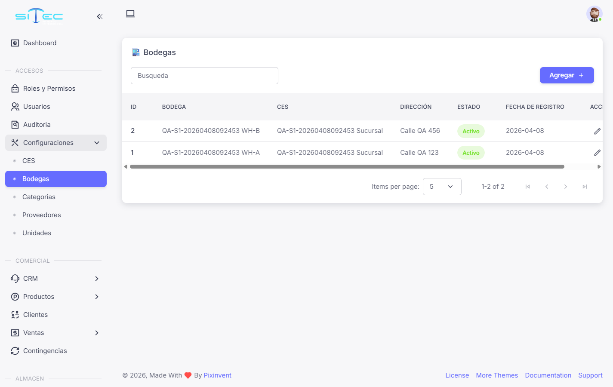

Un almacén es una bodega física dentro de una sucursal. El stock se controla por almacén.

### 14.3 Categorías

**Ruta**: menú lateral → **Configuración** → **Categorías**

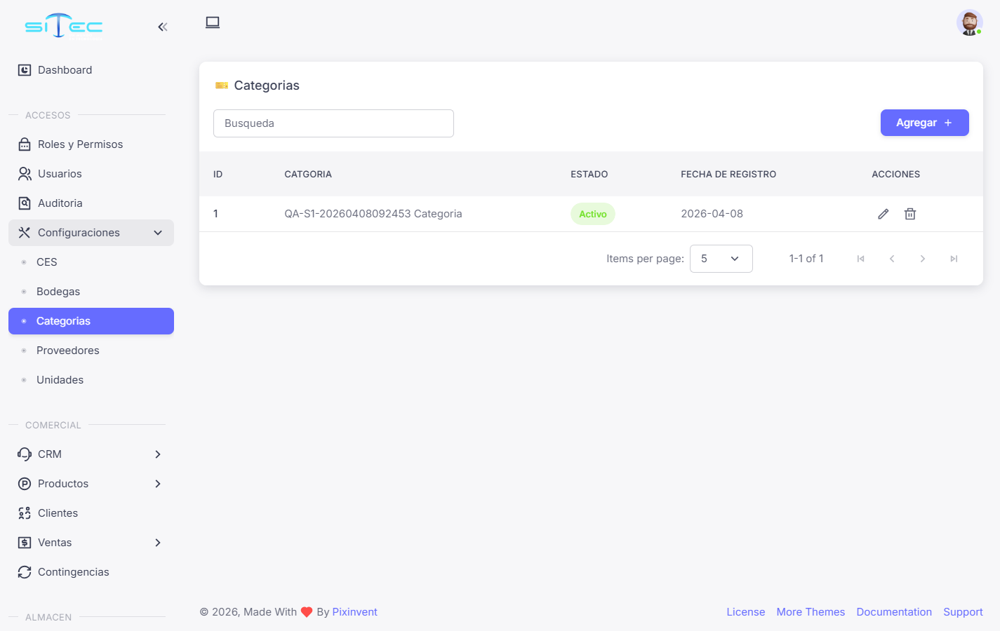

Cada producto pertenece a una categoría. Las categorías permiten agrupar productos para reportes (ventas por categoría, KPI), aplicar permisos de visibilidad y organizar el catálogo.

### 14.4 Unidades

**Ruta**: menú lateral → **Configuración** → **Unidades**

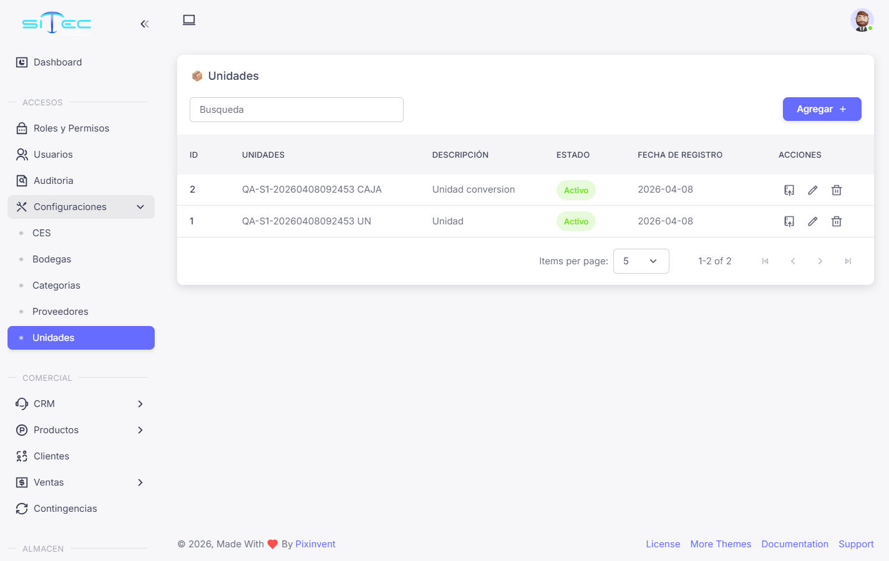

Unidades de medida con las que se vende y compra cada producto: Unidad, Kg, Litro, Caja, Metro, etc.

### 14.5 Proveedores

**Ruta**: menú lateral → **Configuración** → **Proveedores**

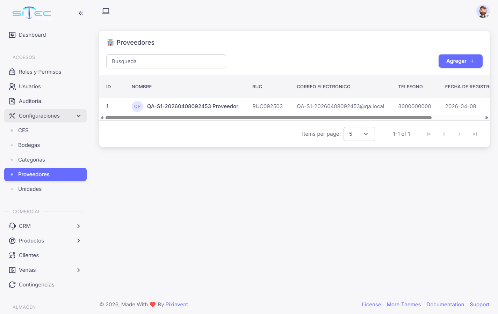

Listado de proveedores con datos de contacto. Se usan al registrar compras.

### 14.6 Conversiones de unidad

**Ruta**: menú lateral → **Configuración** → **Conversiones de unidad**


Define el **factor** entre dos unidades (ej. 1 Caja = 12 Unidades). Es el dato que el módulo de Conversiones (sección 12) usa para calcular cantidades equivalentes al convertir stock.

> Antes de cargar productos por primera vez, completá las categorías y unidades necesarias.

---

## 15. Usuarios, roles y permisos

### 15.1 Usuarios

**Ruta**: menú lateral → **Usuarios**

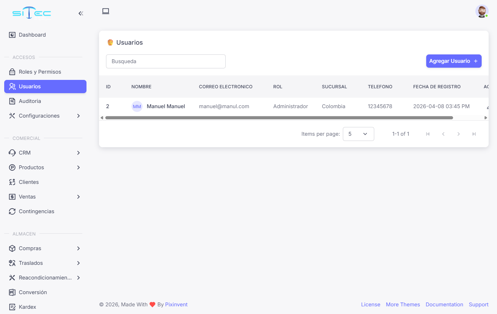

**Acciones:**

- **Crear usuario** — definir nombre, email, contraseña inicial y **rol asignado**
- **Editar** — actualizar datos o cambiar rol
- **Desactivar** — soft delete, el usuario no podrá iniciar sesión

Click en **Agregar usuario** abre el siguiente diálogo:

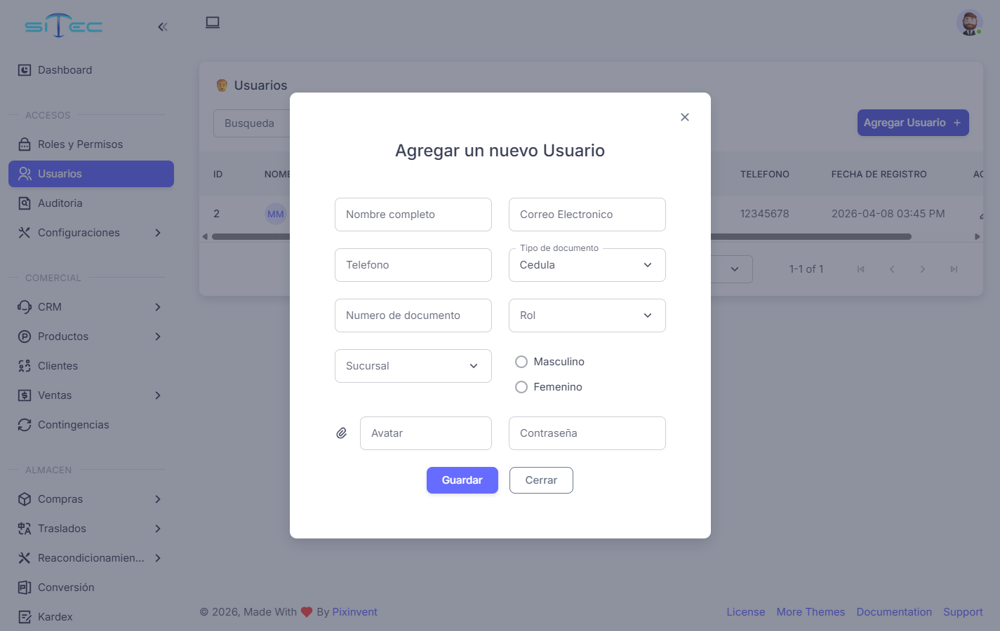

> Las contraseñas iniciales deben comunicarse por canal seguro y forzar cambio en el primer login.

### 15.2 Roles y permisos

**Ruta**: menú lateral → **Roles y Permisos**

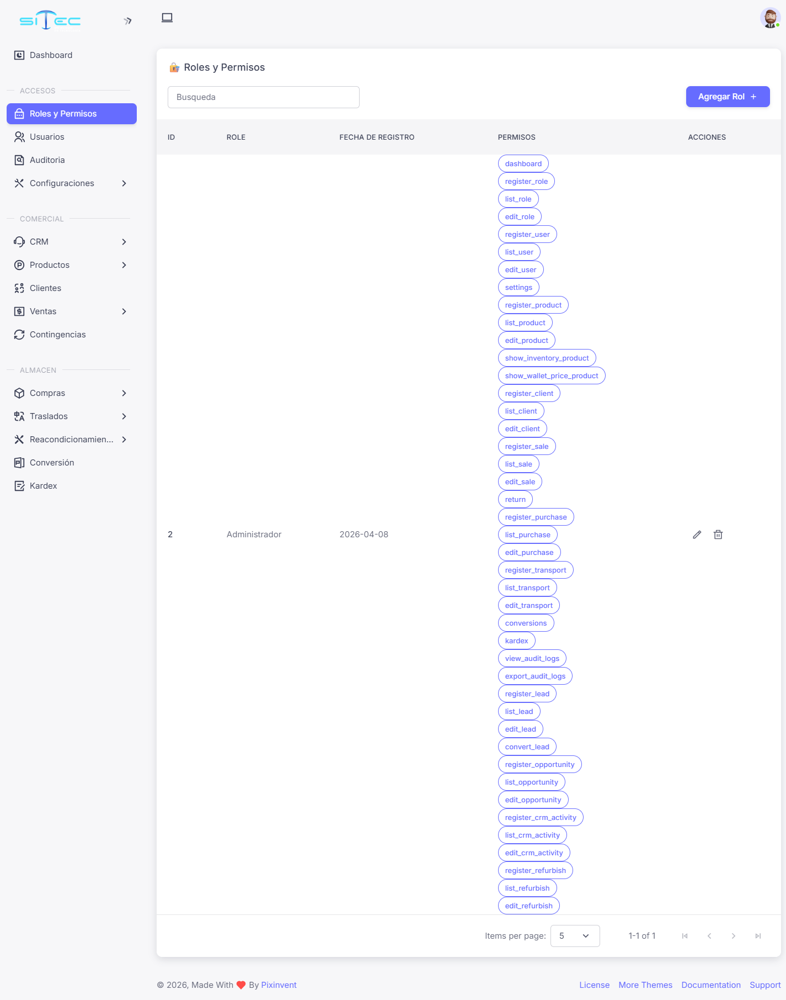

El sistema usa **41 permisos atómicos** agrupados por módulo (Productos, Ventas, Compras, etc.). Un rol es un conjunto de permisos.

**Roles preconfigurados:**

- **Super-Admin** — todos los permisos. Solo para administradores principales.

**Crear un rol nuevo:**

1. Botón **Agregar Rol**
2. Asignar **nombre** (ej. "Vendedor", "Bodeguero", "Gerente")
3. Marcar los permisos que el rol debe tener (ver el diálogo abajo)
4. Guardar

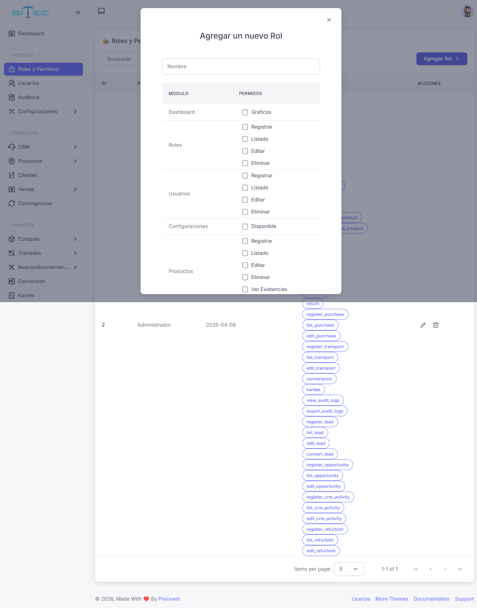

El diálogo presenta los permisos agrupados por módulo (Dashboard, Productos, Ventas, etc.). Marcá las casillas de las acciones que el rol debe ejecutar.

> El sistema aplica automáticamente algunas reglas de coherencia (backfill): por ejemplo, si un rol tiene `list_client` también recibe `list_lead`, ya que en la práctica un asesor que ve clientes también necesita ver prospectos.

**Asignar rol a un usuario:**

Editar el usuario → seleccionar el rol → guardar. El usuario debe **cerrar sesión y volver a entrar** para que los nuevos permisos apliquen.

---

## 16. Perfil y 2FA

**Ruta**: clic en tu avatar (esquina superior derecha) → **Perfil**

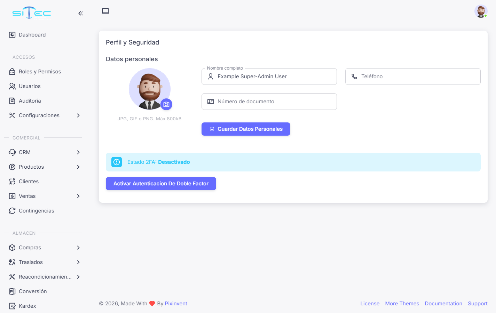

### 16.1 Datos personales

Podés actualizar tu nombre, email, foto de perfil y contraseña desde acá.

### 16.2 Activar autenticación de dos factores (2FA)

**Recomendado para todos los usuarios administrativos.**

Pasos:

1. En la sección **Seguridad**, hacer clic en **Activar 2FA**
2. El sistema muestra un **código QR**
3. Abrir tu app autenticadora (Google Authenticator, Authy, 1Password) y escanear el código
4. La app muestra un código de 6 dígitos que cambia cada 30 segundos
5. Ingresar el código en el sistema y confirmar
6. El sistema te muestra **8 códigos de recuperación** — **descargalos y guardalos en un lugar seguro**. Cada uno se puede usar **una sola vez** si perdés acceso al dispositivo.

### 16.3 Login con 2FA

A partir de la próxima vez:

1. Email + contraseña → enter
2. El sistema pide el **código de 6 dígitos** de tu app autenticadora
3. Ingresar el código → enter
4. Listo, ya estás dentro

### 16.4 Si perdés el dispositivo

Opción A — usar código de recuperación:

1. En la pantalla de 2FA, hacer clic en **Usar código de recuperación**
2. Ingresar uno de los 8 códigos guardados
3. Una vez dentro, ir al perfil y reactivar 2FA con un nuevo dispositivo

Opción B — pedir reseteo a un Super-Admin:

El administrador puede desactivar tu 2FA desde la configuración de tu usuario. **Recordá reactivarlo apenas tengas un nuevo dispositivo**.

---

## 17. Cierre de sesión

**Ruta**: clic en tu avatar (esquina superior derecha) → **Cerrar sesión**

El sistema:

1. Invalida tu token en el servidor (no se podrá reusar)
2. Limpia los datos locales del navegador
3. Te redirige a la pantalla de login

> Por seguridad, **siempre cerrá sesión** al terminar tu jornada o al usar un equipo compartido. La sesión expira automáticamente después de **8 horas** de inactividad.

---

## Preguntas frecuentes

### ¿Por qué no veo un módulo en el menú?

Tu rol no tiene el permiso correspondiente. Pedile a tu administrador que revise la configuración del rol.

### ¿Por qué un cambio en permisos no se aplica?

Los permisos se cargan al iniciar sesión. **Cerrá sesión y volvé a entrar** para que los cambios apliquen.

### ¿Puedo ver el historial de cambios de un producto / venta?

Sí. Desde el detalle del registro, sección **Historial** (o desde Auditoría → Logs filtrando por entidad y ID). Vas a ver quién cambió qué y cuándo.

### ¿Cómo recupero una venta anulada por error?

No es posible recuperarla automáticamente. Hay que crear una venta nueva con los mismos datos. El registro original queda en auditoría para trazabilidad.

### ¿Puedo importar productos desde Excel?

Sí. Usar la plantilla `ejemplo_import.xlsx` que viene con el sistema y subirla desde **Productos → Importar Excel**. El sistema procesa en lotes de 1000 filas y reporta errores por fila.

### ¿Cómo cambio mi contraseña?

Desde tu **Perfil → Seguridad → Cambiar contraseña**. Se requiere ingresar la contraseña actual.

### Si el sistema no responde, ¿qué hago?

1. Refrescar el navegador (F5)
2. Cerrar sesión y volver a entrar
3. Verificar conexión a internet
4. Si persiste, contactar a soporte (ver [docs/OPERACIONES.md §11](./OPERACIONES.md#11-contactos-y-escalamiento))

---

## Referencias

- [Manual de instalación](./INSTALACION.md)
- [Configuración del sistema](./CONFIGURACION.md)
- [Arquitectura](./ARQUITECTURA.md)
- [Manual de operaciones](./OPERACIONES.md)

---

*Documento mantenido en el repositorio. Última actualización: 2026-05-09.*
